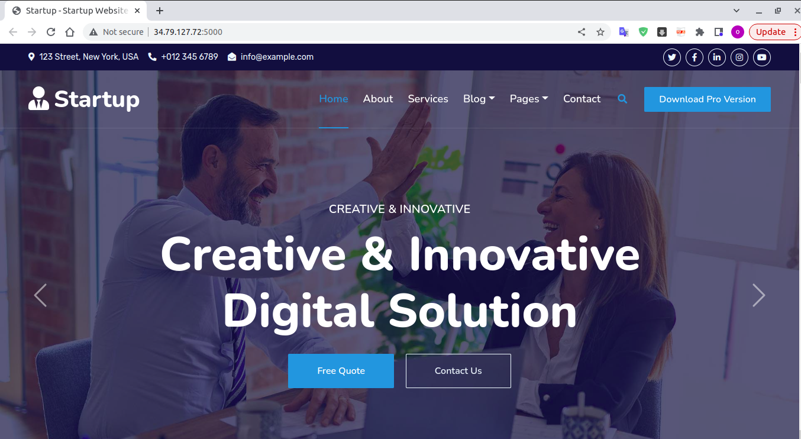
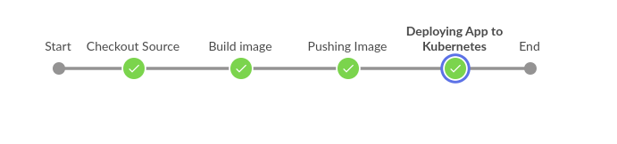

# Demo


## Brief



Provision GCP infrstructure using Jenkinns CI | CD .
## Cloning this project
```bash
$ git clone https://github.com/matriix00/simple-bootstrap.git
```

##  Configure Jenkins 

### 1- Install plugins
Blue Ocean  -  Docker   -  Role-based Authorization Strategy  -  Kubernetes 


### 2- Creating credentials
Docker  -  Github  -  kubernetes-serviceaccount  
### 3- Provide connection to Kubernetes GKE using k8s plugin

- get controlplane url 
```
$ kubectl cluster-info
```
- create serviceaccount and get token
```
$ kubectl create serviceaccount jenkins -n jenkins-namespace
$ kubectl describe secret $(kubectl describe serviceaccount jenkins -n jenkins-namespace | grep Token | awk '{print $2}') -n jenkins-namespace
$ kubectl create rolebinding jenkins-admin-binding --clusterrole=admin --serviceaccount=jenkins-namespace:jenkins -n jenkins-namespace
```
### 4- Creating new user and assign role  using role-based-authorization  plugin

### 5-  Create new pipeline and configure webhook to trigger commit changes 

## Contributing
Pull requests are welcome. For major changes, please open an issue first to discuss what you would like to change.

Please make sure to update tests as appropriate.
